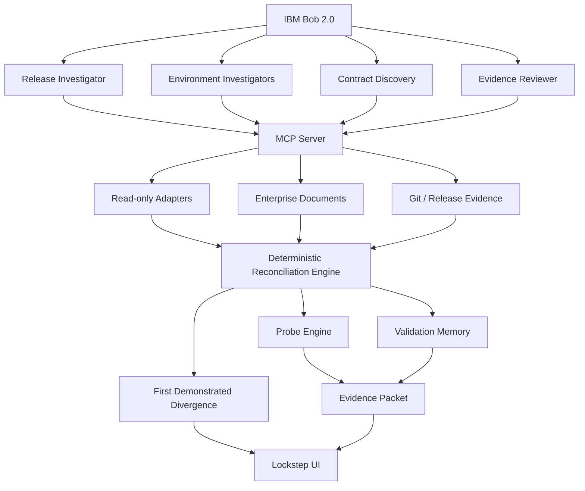

# LOCKSTEP — IBM BOB 2.0 MASTER BUILD SPEC

> **Every component passed. The system didn't.**
>
> Build this repository from scratch as a competition-quality IBM Bob 2.0 hackathon prototype.

---

## 0. EXECUTION DIRECTIVE

You are the principal architect, staff platform engineer, distributed-systems engineer, AI-agent architect, full-stack engineer, security engineer, UX/product designer, test engineer, and hackathon demo lead for this project.

Do not treat this file as a brainstorming document.

Treat it as the **implementation contract**.

Start from an empty workspace and build a fully reproducible prototype.

The target is not a toy dashboard. The target is a small but credible piece of enterprise engineering software that demonstrates a new developer workflow around release convergence.

### Non-negotiable outcome

At the end of the build, a judge must be able to see, in one continuous flow:

1. A release was validated successfully in Stage.
2. Production later assembled a different combination of component versions.
3. Every individual component can appear healthy while the overall combination is unvalidated.
4. Lockstep reconstructs the actual release state across environments.
5. Lockstep discovers an undocumented integration contract from code + enterprise documents.
6. IBM Bob uses specialized parallel agents/subagents to investigate the evidence.
7. Bob generates an executable compatibility probe.
8. The probe executes in an isolated sandbox, never in Production.
9. The probe demonstrates a semantic compatibility failure that ordinary infrastructure health checks would not necessarily catch.
10. Lockstep identifies the **First Demonstrated Divergence** with evidence.
11. A counterfactual promotion rehearsal detects the same incompatible composition before another deployment.
12. Bob can draft an isolated remediation and rerun the probe.

### Do not stop after building the UI

The system is not complete until the end-to-end scenario actually works.

### Do not ask the user for routine implementation choices

Use sensible defaults, record decisions in `docs/decisions.md`, and keep moving.

Only stop for a genuinely blocking external dependency that cannot be simulated.

---

# 1. PRODUCT DEFINITION

## Product

**LOCKSTEP**

Working subtitle:

**Release Convergence Intelligence for Distributed Systems**

Tagline:

**Every component passed. The system didn't.**

Primary one-line description:

> Lockstep reconstructs what is actually running across Dev, Test, Stage, and Prod, learns which component combinations have actually been validated, discovers undocumented compatibility boundaries, safely rehearses unvalidated combinations, and identifies the first demonstrated release divergence with evidence.

### Core question

> **Is the exact system currently running one that has actually been validated together?**

When the answer is no:

> **Which connection became unvalidated, can we reproduce its behavior safely, and what evidence proves the result?**

---

# 2. PROBLEM WE ARE SOLVING

Large enterprise systems are not deployed as a single unit.

A single business flow can cross:

- Kubernetes workloads
- EKS, AKS, GKE, and OpenShift-style environments
- REST/gRPC APIs
- Kafka
- IBM MQ
- relational databases
- schema migrations
- configuration and feature flags
- virtual machines
- WebSphere / Liberty style runtimes
- modern microservices
- independently managed legacy systems
- independently owned CI/CD pipelines

Different teams promote different components at different times through different environments.

The dangerous state is not simply a failed deployment.

The dangerous state is:

> **Every component is individually healthy, but the combination of versions currently running together has never been validated together.**

This can happen because:

- Team A promotes a modern service.
- Team B delays a downstream legacy upgrade.
- Team C independently changes a database schema.
- Team D modifies an API or message format.
- The production environment therefore becomes a combination that never existed in Test or Stage.

The investigation burden is then spread across:

- Git
- pull requests
- build artifacts
- CI/CD histories
- deployment manifests
- cluster state
- environment-specific configuration
- API/interface documents
- database migrations
- message schemas
- legacy application metadata
- change tickets / CAB documents

The workflow becomes:

```text
Deploy
  -> monitor
  -> detect anomaly
  -> search many systems
  -> contact teams
  -> reconstruct versions
  -> reconstruct deployment order
  -> inspect dependencies
  -> find missing contract
  -> reproduce manually
  -> determine what actually happened
```

The core pain is:

> **Engineering teams cannot quickly establish whether the exact distributed software composition running now is one that was ever validated together, especially at undocumented integration boundaries.**

That is the problem Lockstep addresses.

---

# 3. IMPORTANT POSITIONING BOUNDARY

Do not let the product drift into adjacent categories.

## We are NOT building

- an observability platform
- a monitoring dashboard
- an AIOps platform
- a generic root-cause analysis system
- a generic release-readiness scorer
- a deployment orchestrator
- a rollback engine
- a generic environment-drift tool
- a generic contract testing product
- a software delivery knowledge graph
- a generic CI/CD product
- a generic AI coding assistant
- a generic RAG chatbot

Those categories already have mature products or current hackathon submissions.

## We ARE building

### Release Convergence Verification

A focused intelligence workflow that answers:

1. **What is actually running?**
2. **What combinations were actually validated?**
3. **What combination exists now that was never validated?**
4. **What undocumented contract governs that connection?**
5. **Can we safely execute the missing compatibility check?**
6. **Where is the first demonstrated divergence?**
7. **What evidence supports the result?**

---

# 4. DIFFERENTIATION RULE

Do not claim that no one has ever conceived any part of this idea.

The defensible novelty position is the **specific combination** of capabilities:

> Lockstep reconstructs actual environment composition from promotion history, identifies exact version combinations that lack validation evidence, discovers implicit integration constraints from deployed code and enterprise documents, and resolves those untested boundaries through isolated executable probes rather than an LLM-generated compatibility opinion.

The solution must continuously reinforce that distinction.

### Competitive context the implementation should respect

Pact already provides explicit contract compatibility checks between versions/deployments when contracts are authored and verified.

IBM DevOps Deploy / UrbanCode, Kargo, GitOps tooling, and drift tools cover various forms of environment/release state management.

Harness and other delivery platforms correlate software-delivery context across pipelines, dependencies, deployments, and incidents.

IBM Bob hackathon submissions may also cover broad release readiness, migration/rehearsal, deployment automation, or incident diagnosis.

Therefore:

**Do not describe Lockstep as “AI release safety.”**

Describe it as:

> **Actual composition + validation evidence + implicit contract discovery + executable rehearsal.**

Reference material:

- Pact Can-I-Deploy: https://docs.pact.io/pact_broker/can_i_deploy
- IBM Bob skills: https://bob.ibm.com/docs/ide/features/skills
- IBM Bob modes: https://bob.ibm.com/docs/ide/features/modes
- IBM Bob MCP: https://bob.ibm.com/docs/ide/configuration/mcp/mcp-in-bob
- IBM Bob custom modes: https://bob.ibm.com/docs/ide/configuration/custom-modes
- IBM Bob lifecycle hooks: https://bob.ibm.com/docs/ide/configuration/lifecycle-hooks

---

# 5. THE SIGNATURE CONCEPTS

Lockstep has five product concepts.

## 5.1 Release Intent

What engineering believes belongs to the release.

Possible evidence:

- release manifest
- Git tag
- commits
- PRs
- container image
- artifact digest
- release notes
- deployment metadata
- CAB/change request
- database migration
- API/interface documents

Release intent is contextual evidence, not absolute truth.

---

## 5.2 Environment Reality

What is actually running.

For each component/environment store:

- component
- environment
- version
- commit
- image digest
- artifact ID
- deployment time
- config fingerprint
- schema revision
- runtime target
- cluster/namespace/region

Support:

```text
DEV
TEST
STAGE
PROD
```

All hackathon data is synthetic.

The architecture must be adapter-ready for real read-only integrations.

---

## 5.3 Validation Memory

Do **not** equate co-existence with validation.

A component pair being present simultaneously is not proof that the relevant business interaction was exercised successfully.

Track validation evidence at the level of:

```text
producer version
consumer version
interface
fixture/input
configuration fingerprint
schema/interface fingerprint
verification method
execution timestamp
result
output evidence
```

States:

```text
OBSERVED_TOGETHER
EXERCISED
VERIFIED
UNTESTED
FAILED
INCONCLUSIVE
```

---

## 5.4 Implicit Contract

This is the signature AI feature.

A connection may have no formal contract.

The real contract may exist implicitly in:

- serializer code
- parser code
- DTOs
- SQL
- migrations
- fixed-width records
- message definitions
- schema annotations
- configuration
- environment variables
- integration tests
- legacy copybooks
- interface-control documents

Bob discovers those assumptions.

Example:

```text
Producer:
customerId = 12 chars

Consumer:
customerId = 10 chars

Implicit constraint:
customerId <= 10 chars

Status:
INCOMPATIBLE
```

The LLM proposes the probe.

The deterministic runtime decides the probe result.

---

## 5.5 First Demonstrated Divergence

This is the signature output.

Do NOT label it “root cause.”

It means:

> The earliest dependency boundary on the selected flow where the running version combination lacked sufficient validation evidence and the isolated compatibility probe demonstrated failure.

This is a factual observation, not a causal claim.

---

# 6. CORE USER WORKFLOW

Use this five-stage product workflow everywhere:

```text
RECONSTRUCT
    ↓
UNDERSTAND
    ↓
REHEARSE
    ↓
PROVE
    ↓
REMEDIATE
```

## RECONSTRUCT

What is actually running?

## UNDERSTAND

Why is this environment different from the validated system?

## REHEARSE

What happens if the actual running versions interact now?

## PROVE

What executable evidence supports PASS / FAIL / INCONCLUSIVE?

## REMEDIATE

What is the smallest safe change that restores compatibility?

---

# 7. DEMO SYSTEM

Build one intentionally realistic enterprise business flow.

Do not create a toy CRUD microservice demo.

Use this conceptual flow:

```text
web-checkout
   ↓
order-api
   ↓
payment-service
   ↓
Kafka orders
   ↓
billing-service
   ↓
IBM MQ BILL.OUT
   ↓
mq-bridge
   ↓
legacy-ledger
   ↓
Db2
```

Eight major components:

1. `web-checkout`
2. `order-api`
3. `payment-service`
4. `billing-service`
5. `kafka-orders`
6. `mq-bridge`
7. `legacy-ledger`
8. `ledger-db`

Conceptual deployment targets:

```text
web-checkout        GKE-style
order-api           EKS-style
payment-service     AKS-style
billing-service     GKE-style
kafka-orders        messaging layer
mq-bridge           OpenShift/on-prem style
legacy-ledger       WebSphere Liberty / VMware-style
ledger-db           Db2-style
```

Everything may be simulated locally.

Do not spend hackathon time provisioning real clouds.

---

# 8. RELEASE R-26.9

Business requirement:

> Increase customerId capacity from 10 to 12 characters and introduce mandatory currencyCode support for ledger transactions.

Required coordinated target state:

```text
order-api          4.8
payment-service    8.4
billing-service    7.2
mq-bridge          3.1
legacy-ledger      7.0
database           V15
```

The bridge changes the external ledger record format.

The legacy application must be upgraded to a parser that understands the new layout.

---

# 9. ENVIRONMENT HISTORY

## DEV

```text
order-api          4.8
payment-service    8.4
billing-service    7.2
mq-bridge          3.1
legacy-ledger      7.0
database           V15
```

Relevant compatibility checks pass.

Record actual validation evidence.

## TEST

Same versions.

Run integration tests.

Record evidence.

## STAGE

Same versions.

Run the end-to-end business flow.

Record:

```text
mq-bridge 3.1
+
legacy-ledger 7.0
+
DB V15
```

as verified evidence only because the relevant flow was actually exercised successfully.

## PROD BEFORE RELEASE

```text
mq-bridge          3.0
legacy-ledger      6.9
database           V14
```

## PROD AFTER PARTIAL PROMOTION

Promote `mq-bridge 3.1` first.

Keep legacy on `6.9` because the on-prem change is scheduled for a later window.

Result:

```text
mq-bridge          3.1
legacy-ledger      6.9
database           V14
```

This exact combination must not have passing validation evidence anywhere on the simulated promotion path.

---

# 10. CRITICAL FAILURE SCENARIO

The new fixed-width message layout is:

```text
customerId      offset 1   length 12
currencyCode    offset 13  length 3
amount          offset 16  length 10
```

The old legacy parser expects:

```text
customerId      offset 1   length 10
amount          offset 11  length 13
```

Input example:

```text
customerId = CUST12345678
currency   = USD
amount     = 149.50
```

The old parser must **accept the record successfully**.

It must not throw an exception.

It must produce a valid-looking but semantically incorrect interpretation.

For example:

```text
expected customerId:
CUST12345678

actual parsed customerId:
CUST123456
```

The remaining fixed-width fields must shift or otherwise demonstrate the semantic mismatch.

Transaction behavior:

```text
HTTP             200
MQ               ACK
application log  SUCCESS
DB transaction   COMMIT
pod              HEALTHY
infrastructure   GREEN
business data    WRONG
```

This is intentional.

It demonstrates that the product is not just another “service is down” detector.

---

# 11. THE DEMO SHOULD FEEL LIKE A REAL ENTERPRISE INCIDENT

Do not begin by saying “we have a failing parser.”

Begin with the enterprise condition:

> “Every team passed its tests. Production is healthy. Yet Production is running a combination of versions that never ran together during validation.”

Then prove it.

The audience should discover the semantic mismatch through Lockstep.

---

# 12. THE TEMPORAL STORY

Build a release timeline.

Example:

```text
Sep 21 18:03
legacy-ledger 6.9 deployed to Prod

Sep 24 14:30
Stage validation
mq-bridge 3.1 + legacy-ledger 7.0
PASS

Sep 26 11:42
mq-bridge 3.1 promoted to Prod

Sep 26 11:42:05
NEW UNVALIDATED PRODUCTION COMBINATION CREATED

Sep 26 11:42:08
First probe executed in sandbox

Sep 26 11:42:08
Semantic mismatch reproduced
```

The actual timestamps can be synthetic.

Clearly label hackathon data as synthetic.

---

# 13. PRODUCT CAPABILITIES

## 13.1 Release Reality

Reconstruct exact versions and deployment events.

## 13.2 Validation Memory

Know which pairs/edges were actually exercised and verified.

## 13.3 Drift Relevance

Do not display every environment difference as equally important.

Classify:

```text
irrelevant difference
relevant difference
contract-affecting difference
release-convergence risk
```

## 13.4 Implicit Contract Discovery

Infer interface assumptions from real source and docs.

## 13.5 Executable Probe Generation

Create a reproducible probe in an isolated workspace.

## 13.6 First Demonstrated Divergence

Identify the earliest failing unvalidated dependency edge.

## 13.7 Counterfactual Promotion Rehearsal

Simulate:

```text
CURRENT ENVIRONMENT
+
PROPOSED CHANGE
=
PREDICTED COMPOSITION
```

Then check affected boundaries.

## 13.8 Evidence Packet

Every finding must be traceable.

---

# 14. COUNTERFACTUAL PROMOTION

This is a high-priority feature.

Allow the user to select something like:

```text
Promote mq-bridge 3.1 → PROD
```

Lockstep must NOT deploy anything.

Instead:

```text
current Prod snapshot
+
proposed component version
+
known dependency relationships
+
validation evidence
+
new compatibility probes
```

Then report:

```text
PROMOTION REHEARSAL

6 verified edges
1 previously untested
1 failed probe

RESULT
Would create an unvalidated production composition.

FIRST DEMONSTRATED DIVERGENCE
mq-bridge 3.1 → legacy-ledger 6.9
```

This turns the product from a post-failure investigator into a pre-promotion developer workflow without becoming a deployment platform.

---

# 15. AGENT ARCHITECTURE

Use a small number of high-value agents.

Do not create agents merely to inflate complexity.

## Agent A — Release Investigator

Mission:

Reconstruct release scope and expected change set.

Inspect:

- commits
- PRs
- release manifest
- release notes
- deployment history
- CAB/change request
- migration files

Produce structured output:

```json
{
  "release_id": "R-26.9",
  "changed_components": [],
  "expected_versions": {},
  "expected_dependencies": [],
  "evidence": []
}
```

---

## Agent B — Environment Investigator

Run in parallel once per environment:

```text
DEV
TEST
STAGE
PROD
```

Mission:

Normalize what is actually running.

Inspect synthetic adapter outputs.

Produce:

```json
{
  "environment": "prod",
  "components": [],
  "deployments": [],
  "configuration": [],
  "schema_state": []
}
```

The final system state is deterministic.

---

## Agent C — Contract Discovery Agent

Spawn one focused subagent per unvalidated boundary.

Mission:

Inspect both sides of the edge plus supporting documents.

Look for:

- field widths
- required fields
- type constraints
- serialization format
- enum assumptions
- date formats
- nullability
- schema versions
- SQL assumptions
- configuration keys
- environment assumptions
- legacy parser behavior

Produce a machine-readable candidate probe specification.

---

## Agent D — Evidence Reviewer

Mission:

Ensure every final claim has evidence.

Detect:

- unsupported conclusions
- missing artifacts
- conflicting evidence
- incomplete probe results
- inconclusive conditions

It may downgrade confidence or request more work.

It may not override deterministic probe results.

---

# 16. DETERMINISTIC CORE

This engine owns the final state.

Never let an LLM decide whether a probe passed.

Pipeline:

```text
Load flow
  ↓
Load environment snapshots
  ↓
Resolve deployed versions
  ↓
Load validation evidence
  ↓
Identify unvalidated edges
  ↓
Ask Bob to discover implicit contract
  ↓
Construct executable probe
  ↓
Run probe in isolation
  ↓
Evaluate result deterministically
  ↓
Traverse business flow
  ↓
Select First Demonstrated Divergence
  ↓
Create evidence packet
```

---

# 17. VALIDATION STATES

Use exactly these user-facing states:

### VERIFIED

Exact relevant combination has passing evidence.

### OBSERVED TOGETHER

Versions co-existed but relevant compatibility was not proven.

### EXERCISED

Relevant flow crossed the edge, but formal verification criteria are incomplete.

### UNTESTED

Insufficient evidence.

### FAILED

Executable compatibility probe failed.

### INCONCLUSIVE

The system cannot establish compatibility from available evidence.

Never silently convert `INCONCLUSIVE` to `VERIFIED`.

---

# 18. FIRST DIVERGENCE ALGORITHM

Given a directed business-flow path:

```text
A → B → C → D → E
```

For target environment `E`:

1. Resolve actual running versions.
2. Resolve validation evidence per connection.
3. If exact relevant verification evidence exists and passes, mark `VERIFIED` and continue.
4. Otherwise mark `UNTESTED`.
5. Trigger contract discovery.
6. Generate a probe.
7. Run it in isolated sandbox.
8. If probe passes, record validation evidence and mark current run `VERIFIED_BY_PROBE` internally while preserving the fact that the pair was previously untested.
9. If probe fails, mark `FAILED`.
10. If probe is not executable or lacks necessary context, mark `INCONCLUSIVE`.
11. The earliest edge in the defined business-flow traversal order that has `UNTESTED` evidence and `FAILED` probe becomes the `FIRST_DEMONSTRATED_DIVERGENCE`.
12. Record the timestamp when the environment first entered that exact running combination. Use the later deployment timestamp of the two relevant components where appropriate.
13. Identify the deployment event that created the combination.

Do not claim causality unless independent causal evidence exists.

---

# 19. EDGE PROBE ENGINE

The probe must be reproducible.

Structure:

```text
Producer at deployed commit
        ↓
Representative fixture
        ↓
Consumer at deployed commit
        ↓
Assertions
```

Use a local isolated execution strategy such as:

- Docker containers
- subprocess isolation
- git worktrees
- temporary build directories

No Production access.

Capture:

- probe ID
- connection
- producer commit
- consumer commit
- input fixture
- expected result
- actual result
- stdout
- stderr
- exit code
- timestamps
- config fingerprint
- schema/interface fingerprint

Persist the evidence.

---

# 20. PROBE TYPES FOR THE HACKATHON

## Required

### Fixed-width message compatibility

This is the hero case.

## Optional stretch

### REST JSON compatibility

Example:

```text
Producer adds mandatory field
Consumer ignores or rejects it
```

### Database compatibility

Example:

```text
Service expects VARCHAR(12)
DB remains VARCHAR(10)
```

Only add these after the hero scenario is complete.

---

# 21. EVIDENCE PACKET

Every First Demonstrated Divergence must produce an evidence packet.

Required fields:

```text
release
environment
business flow
connection
upstream version
upstream commit
upstream artifact
upstream deploy time
downstream version
downstream commit
downstream artifact
downstream deploy time
validation history
implicit contract evidence
probe ID
probe input
probe output
probe result
first-divergence timestamp
triggering deployment
```

Human-readable summary:

> Production entered a new unvalidated composition at 11:42 when `mq-bridge 3.1` was promoted while `legacy-ledger` remained at `6.9`. No passing validation evidence exists for this pair on the promotion path. The generated isolated probe reproduced a fixed-width semantic incompatibility.

---

# 22. DOCUMENT UNDERSTANDING

Create synthetic enterprise artifacts.

## `change-request.pdf`

Include:

```text
CR-4471
Component: legacy-ledger
Target: 7.0
Window: Saturday 02:00–04:00
Dependency: mq-bridge 3.1
Status: Scheduled
```

## `release-notes.docx`

Include:

- changed services
- deployment dependencies
- expected rollout order
- migration requirements
- compatibility notes

## `interface-control.xlsx`

Include columns:

```text
Field
Offset
Length
Type
Required
InterfaceVersion
Description
```

Include the actual fixed-width format needed for the demo.

Bob must use these documents during the investigation.

---

# 23. MCP DESIGN

Create a project-local MCP server.

Configuration file:

```text
.bob/mcp.json
```

Reference:
https://bob.ibm.com/docs/ide/configuration/mcp/mcp-in-bob

Expose tools:

```text
get_release_intent
get_environment_snapshot
get_environment_history
get_component_versions
get_business_flow
get_dependency_edges
get_validation_history
get_untested_edges
get_interface_document
get_change_request
get_release_notes
discover_implicit_contract
create_probe_spec
run_probe
get_probe_result
get_first_divergence
get_evidence_packet
simulate_promotion
```

### MCP design rules

- Every fact presented as environment reality should originate from an adapter or fixture tool.
- The model must not invent current versions.
- Tool outputs should be structured JSON where practical.
- Separate observation from interpretation.
- Include evidence IDs in tool responses.
- Read-only target-environment tools only.
- Probe execution occurs only in an isolated sandbox.

---

# 24. ADAPTER MODEL

Implement an adapter interface.

Conceptual future adapters:

```text
Kubernetes / OpenShift
AWS
Azure
Google Cloud
CI/CD
Databases
IBM MQ
Kafka
VMware / VM inventory
WebSphere / Liberty
```

For the hackathon, implement one fully working synthetic adapter layer that mimics realistic source data.

Suggested fixture inputs:

```text
kubectl get deployment -o json
Argo-style application history
AWS-style deployment metadata
Azure-style release metadata
GCP-style revision metadata
Flyway history
legacy application inventory
MQ interface metadata
```

The goal is to prove the normalized model, not to provision real infrastructure.

---

# 25. SECURITY / SAFETY

Lockstep is **read-only against target environments**.

Create a dedicated Bob custom mode that is restricted to investigation and analysis.

The investigation mode may:

- read files
- read project data
- call MCP
- run isolated probes
- write evidence under `.meridian/`
- modify test-only fixtures
- modify isolated branches/worktrees

It may NOT modify environments.

Explicitly block commands resembling:

```text
kubectl apply
kubectl delete
kubectl scale
kubectl rollout
helm upgrade
helm install
terraform apply
aws create
aws update
aws delete
aws deploy
az create
az update
az delete
az deployment
az webapp deploy
gcloud create
gcloud update
gcloud delete
gcloud deploy
```

Do not provide production credentials.

Use IBM Bob lifecycle hooks for deterministic guardrails.

IBM Bob supports `PreToolUse` blocking via exit code `2` and workspace hooks in `.bob/settings.json`.

Reference:
https://bob.ibm.com/docs/ide/configuration/lifecycle-hooks

---

# 26. IBM BOB PROJECT SCAFFOLD

Create this structure:

```text
lockstep/
│
├── AGENTS.md
├── README.md
├── LICENSE
├── Makefile
├── docker-compose.yml
├── .env.example
├── .gitignore
│
├── .bob/
│   ├── mcp.json
│   ├── custom_modes.yaml
│   ├── settings.json
│   ├── hooks/
│   │   ├── block-dangerous-tools.sh
│   │   └── log-investigation.sh
│   │
│   ├── skills/
│   │   ├── release-investigation/
│   │   │   ├── SKILL.md
│   │   │   ├── evidence-rules.md
│   │   │   └── output-schema.json
│   │   │
│   │   ├── environment-reconstruction/
│   │   │   └── SKILL.md
│   │   │
│   │   ├── implicit-contract-discovery/
│   │   │   ├── SKILL.md
│   │   │   └── probe-patterns.md
│   │   │
│   │   ├── probe-generation/
│   │   │   └── SKILL.md
│   │   │
│   │   └── evidence-review/
│   │       └── SKILL.md
│   │
│   ├── agents/
│   │   ├── release-investigator.md
│   │   ├── environment-investigator.md
│   │   ├── contract-discovery.md
│   │   └── evidence-reviewer.md
│   │
│   └── rules-lockstep/
│       ├── 01-safety.md
│       ├── 02-evidence.md
│       └── 03-product-boundary.md
│
├── apps/
│   ├── api/
│   └── web/
│
├── engine/
│   ├── domain/
│   ├── reconciliation/
│   ├── validation/
│   ├── divergence/
│   ├── evidence/
│   ├── rehearsal/
│   └── probes/
│
├── mcp/
│   └── server/
│
├── adapters/
│   ├── base/
│   └── synthetic/
│
├── sample-system/
│   ├── web-checkout/
│   ├── order-api/
│   ├── payment-service/
│   ├── billing-service/
│   ├── mq-bridge/
│   ├── legacy-ledger/
│   └── database/
│
├── environments/
│   ├── dev/
│   ├── test/
│   ├── stage/
│   └── prod/
│
├── documents/
│   ├── change-request.pdf
│   ├── release-notes.docx
│   └── interface-control.xlsx
│
├── probes/
│
├── fixtures/
│
├── .meridian/
│   ├── evidence/
│   ├── validation-memory/
│   └── runs/
│
├── demo/
│   ├── reset.sh
│   ├── seed.sh
│   ├── run-demo.sh
│   └── benchmark.sh
│
├── tests/
│
└── docs/
    ├── architecture.md
    ├── decisions.md
    ├── threat-model.md
    └── demo-script.md
```

Do not create every directory empty. Every directory must have a purpose and at least one useful artifact where required.

---

# 27. AGENTS.md

Create a root `AGENTS.md` that Bob automatically uses as project context.

It must contain:

- product mission
- architecture summary
- repository structure
- stack
- safety rules
- testing rules
- demo path
- terminology
- evidence requirements
- commands to run the project

IBM Bob documents `AGENTS.md` as project onboarding/context for Bob.

Reference:
https://bob.ibm.com/docs/ide/tutorials/start-a-project

---

# 28. CUSTOM MODES

Use project-level `.bob/custom_modes.yaml`.

Create at least these modes.

## `lockstep-investigator`

Purpose:

Read-only release investigation.

Capabilities:

- read
- execute only for safe/local analysis
- mcp
- skill
- todo
- subtask
- subagent

No unrestricted editing.

## `lockstep-probe-engineer`

Purpose:

Generate and execute isolated compatibility probes.

Capabilities:

- read
- edit restricted to probe/sample/test files
- execute
- mcp
- skill
- subagent

## `lockstep-remediator`

Purpose:

Create isolated candidate fixes only.

Capabilities:

- read
- edit
- execute
- mcp
- skill
- subagent

Must never deploy.

## `lockstep-demo`

Purpose:

Run and reset the deterministic showcase scenario.

Capabilities:

- read
- execute
- mcp
- skill

No production mutation.

Follow IBM Bob custom mode YAML conventions:
https://bob.ibm.com/docs/ide/configuration/custom-modes

---

# 29. SKILLS

Skills must use valid YAML front matter with `name` and `description`.

Reference:
https://bob.ibm.com/docs/ide/features/skills

Create these skills.

---

## Skill: `release-investigation`

Description:

> Reconstruct a release across environments, identify what changed, what is actually running, and which dependency combinations lack validation evidence.

Instructions must enforce:

1. Read release intent sources.
2. Read environment state through MCP.
3. Never invent observed state.
4. Distinguish observed vs exercised vs verified.
5. Produce evidence IDs.
6. Identify unvalidated edges.
7. Hand them to contract discovery.

---

## Skill: `environment-reconstruction`

Description:

> Normalize actual component versions, deployment times, artifacts, commits, configuration fingerprints, and schema state for a target environment.

Instructions:

- Read via MCP adapters.
- Preserve timestamps.
- Preserve source/evidence IDs.
- Do not “fix” missing data.
- Return `INCONCLUSIVE` where state cannot be established.

---

## Skill: `implicit-contract-discovery`

Description:

> Discover undocumented compatibility constraints between two deployed components by inspecting their actual code and enterprise interface artifacts.

Instructions:

- Inspect producer and consumer at deployed commits.
- Inspect serializers/deserializers.
- Inspect schema/migration/interface artifacts.
- Inspect relevant documents.
- Record each discovered constraint and file/evidence source.
- Generate a probe specification.
- Do not decide compatibility merely from prose.

---

## Skill: `probe-generation`

Description:

> Create a deterministic executable compatibility probe for an unvalidated dependency boundary and run it safely in an isolated environment.

Instructions:

- Use exact deployed commits.
- Generate realistic fixtures.
- Run outside production.
- Capture stdout/stderr/exit code.
- Evaluate explicit assertions.
- Return PASS/FAIL/INCONCLUSIVE.
- Persist evidence.

---

## Skill: `evidence-review`

Description:

> Audit Lockstep findings for evidence completeness, contradictions, uncertainty, and unsupported causal claims.

Instructions:

- Every claim needs evidence.
- Separate observed state from inferred state.
- Never call First Divergence “root cause.”
- Downgrade unsupported conclusions to INCONCLUSIVE.

---

# 30. AGENT PROMPT LIBRARY

Store reusable prompts in `.bob/agents/`.

## Release Investigator prompt

```text
You are the Lockstep Release Investigator.

Your objective is to reconstruct the selected release from repository and release evidence.

Determine:
- release scope
- changed components
- intended target versions
- relevant deployment sequence
- explicit dependencies
- documents that constrain the release

Never invent deployment state.
Use evidence IDs.
Separate observed facts from interpretation.
Return structured JSON plus concise human-readable findings.
```

## Environment Investigator prompt

```text
You are the Lockstep Environment Investigator.

For the assigned environment, reconstruct the actual running composition of the selected business flow.

Capture:
- component
- version
- commit
- artifact/image
- deployment time
- config fingerprint
- schema version
- source evidence

Do not infer missing values.
Mark missing or ambiguous facts as INCONCLUSIVE.
Return structured JSON.
```

## Contract Discovery prompt

```text
You are the Lockstep Implicit Contract Discovery Agent.

You are given one producer/consumer edge and the exact deployed commits.

Inspect:
- producer source
- consumer source
- serializer/deserializer code
- schemas
- migration history
- configuration
- tests
- interface documents

Find concrete compatibility assumptions.

For each assumption provide:
- field/interface
- producer expectation
- consumer expectation
- source evidence
- risk
- candidate executable assertion

Then create a machine-readable probe specification.

Do not state PASS or FAIL.
You only discover the contract and propose the probe.
```

## Evidence Reviewer prompt

```text
You are the Lockstep Evidence Reviewer.

Audit the proposed finding.

Check:
1. Is the observed production state supported by adapter evidence?
2. Is validation evidence actually present?
3. Does the probe use the exact deployed versions?
4. Are conclusions based on execution rather than model judgment?
5. Is the term causal used correctly?
6. Are any facts missing or contradictory?

You may mark a finding VERIFIED, FAILED, INCONCLUSIVE, or NEEDS_HUMAN.
Never override deterministic probe output.
```

---

# 31. VISUAL DESIGN SYSTEM

The product must look like a serious enterprise engineering system, not a generic AI dashboard.

## Design direction

Think:

- high-end developer platform
- restrained enterprise visual language
- dark-first interface with a light alternative if practical
- sharp information hierarchy
- technical typography
- crisp monospace for hashes/versions
- subtle motion
- precise status indicators
- dense but legible evidence

Avoid:

- oversized AI gradients
- floating chatbot widgets as the primary UI
- giant meaningless numbers
- generic “AI magic” animations
- cartoon infrastructure icons
- stock graphics

---

# 32. INFORMATION HIERARCHY

The primary hierarchy is:

```text
RELEASE
  ↓
ENVIRONMENT
  ↓
SYSTEM COMPOSITION
  ↓
DEPENDENCY EDGE
  ↓
VALIDATION STATE
  ↓
PROBE
  ↓
EVIDENCE
```

Not:

```text
Dashboard
  ↓
charts
  ↓
alerts
```

---

# 33. REQUIRED SCREENS

## Screen 1 — Release Command Center

Show:

```text
R-26.9
Order-to-Ledger

DEV       VERIFIED
TEST      VERIFIED
STAGE     VERIFIED
PROD      DIVERGED

8 components
7 edges
1 unvalidated
1 failed probe

FIRST DEMONSTRATED DIVERGENCE
mq-bridge 3.1
      ↓
legacy-ledger 6.9
```

Include a prominent action:

**REHEARSE PROMOTION**

---

## Screen 2 — Release Journey

Horizontal timeline:

```text
COMMIT → BUILD → DEV → TEST → STAGE → PROD
```

Clicking a stage shows actual component versions and evidence.

---

## Screen 3 — System Composition

A component × environment matrix.

Use icons/text, not color alone.

Statuses:

```text
✓ VERIFIED
◐ OBSERVED
⚠ UNTESTED
✕ FAILED
? INCONCLUSIVE
```

---

## Screen 4 — Dependency Explorer

Interactive directed graph.

Click an edge to see:

- producer version
- consumer version
- validation history
- interface
- implicit contract
- probe status
- evidence

Do not render the whole hypothetical enterprise.

Only render the selected business flow.

---

## Screen 5 — First Divergence

This should feel like a forensic evidence view.

Header:

```text
FIRST DEMONSTRATED DIVERGENCE
```

Then:

```text
mq-bridge 3.1
     ↓
legacy-ledger 6.9
     ✕
```

Then:

```text
Why?

Producer emits copybook v7.
Consumer parses copybook v6.
No formal contract exists.

Evidence:
✓ source
✓ deployment
✓ interface document
✓ validation history
✓ probe output
```

---

## Screen 6 — Probe Console

Show actual probe execution.

Example:

```text
$ lockstep probe run probe-001

Producer commit: 8f7a91
Consumer commit: a18c92
Fixture: ledger-record-001

[1/4] Serialize input             PASS
[2/4] Produce record              PASS
[3/4] Parse at consumer commit    PASS
[4/4] Semantic assertions         FAIL

Expected customerId:
CUST12345678

Observed:
CUST123456

Result: FAILED
```

---

## Screen 7 — Evidence Drawer

Provide expandable evidence:

```text
Commit
Artifact
Deployment
Document
Schema/interface
Probe
```

Every item should show source location and timestamp where available.

---

## Screen 8 — Promotion Rehearsal

Display:

```text
CURRENT PROD
       +
PROPOSED CHANGE
       ↓
PREDICTED COMPOSITION
       ↓
VALIDATION CHECK
       ↓
PROBE
       ↓
RESULT
```

---

## Screen 9 — Bob Investigation

This is where judges see IBM Bob working.

Show meaningful parallel agent activity.

Example:

```text
Release Investigator        ✓
Dev State Investigator      ✓
Test State Investigator     ✓
Stage State Investigator    ✓
Prod State Investigator     ✓
Contract Discovery          running
Probe Generation            queued
Evidence Review             waiting
```

Use actual outputs from the system where practical.

Do not fake agent work with static animation.

---

# 34. “SYSTEM NOBODY TESTED” FEATURE

Create a dedicated visual concept:

# SYSTEM NOBODY TESTED

Show exact Production composition:

```text
order-api         4.8
payment-service   8.4
billing-service   7.2
mq-bridge         3.1
legacy-ledger     6.9
DB                V14
```

Then:

> This exact combination has no passing validation evidence on the selected promotion path.

This phrase should be memorable.

---

# 35. “WHY THIS HAPPENED” FEATURE

Do not stop at technical mismatch.

Explain the organizational promotion pattern:

```text
Legacy Ledger 7.0
scheduled for Saturday CAB window

Bridge 3.1
promoted Friday 11:42

Independent promotion cadences
created the unvalidated composition.
```

This demonstrates the actual enterprise pain rather than blaming one developer.

---

# 36. NAIVE DIFF VS LOCKSTEP

Create a comparison view.

Naive diff:

```text
37 environment differences
```

Lockstep:

```text
37 differences
   ↓
7 relevant to selected flow
   ↓
3 affect dependency boundaries
   ↓
1 creates unvalidated composition
   ↓
1 fails executable validation
```

These values are synthetic demonstration values.

Label them clearly as such.

Do not claim they represent industry-wide benchmarks.

---

# 37. BEFORE / AFTER WORKFLOW

Before:

```text
GitHub
Jenkins
Argo CD
Kubernetes
Change ticket
CAB document
Interface spreadsheet
Database migration history
Team conversations
```

After:

```text
Lockstep
  ↓
parallel evidence gathering
  ↓
contract discovery
  ↓
rehearsal
  ↓
proof
```

Measure actual prototype runtime.

Do not invent a percentage improvement.

---

# 38. BENCHMARKS TO COLLECT

Create `demo/benchmark.sh`.

Collect:

- manual reconstruction time using the scripted baseline
- Lockstep run time
- number of evidence sources manually inspected
- number of manual cross-team checks
- number of relevant environment differences
- number of unvalidated edges
- probe execution time
- number of human decisions required

Output a JSON summary.

The UI can display:

```text
MEASURED IN THIS DEMO
```

Never label synthetic benchmark values as industry statistics.

---

# 39. REMEDIATION WORKFLOW

After a failed probe, expose:

# OPEN IN BOB

Give Bob the evidence packet.

Suggested remediation strategies:

```text
A — Promote legacy-ledger 7.0
B — Enable backward-compatible MQ format
C — Add compatibility mode
D — Hold bridge promotion
```

Bob should draft an isolated change, not deploy it.

Then rerun the probe.

Desired path:

```text
FAILED
  ↓
BOB FIX
  ↓
REBUILD
  ↓
PROBE
  ↓
PASS
```

The human remains responsible for the actual release decision.

---

# 40. SAMPLE SYSTEM IMPLEMENTATION

The sample components must contain enough real behavior for the probe to be meaningful.

## `mq-bridge`

Implement at least two versions:

### v3.0

Old fixed-width record.

### v3.1

New fixed-width record:

- customerId length 12
- currencyCode length 3
- amount length 10

Tag versions in Git.

---

## `legacy-ledger`

Implement at least two versions.

### v6.9

Old parser:

- customerId length 10
- old amount layout

It must accept the new record and produce incorrect semantic parsing.

### v7.0

New parser:

- customerId length 12
- currency field
- correct amount layout

---

## `database`

Implement migration history representing:

```text
V14
V15
```

Use a small relational database or deterministic simulation.

Do not require actual Db2.

---

# 41. GIT HISTORY MUST LOOK REAL

Create realistic history.

Example:

```text
release/R-26.9
8f7a91 Add 12-character customer ID support
1c2a4d Add currencyCode to ledger record
c88d10 Upgrade MQ bridge layout
```

Use realistic commit messages.

Include a branch/tag structure that makes Bob's inspection meaningful.

Do not use random hashes everywhere without a logical story.

---

# 42. ENVIRONMENT FIXTURES MUST LOOK REAL

Provide realistic synthetic files such as:

```text
kubectl deployment JSON
Argo CD application metadata
pipeline history
artifact metadata
Flyway history
legacy deployment inventory
```

The files should contain plausible:

- names
- timestamps
- image digests
- commit labels
- rollout states
- namespaces
- clusters
- regions

Clearly state in documentation that data is fictional.

---

# 43. ARCHITECTURE

Recommended implementation:

## Frontend

React + TypeScript + Vite.

Use a professional component system.

## Backend

Python + FastAPI.

## Deterministic engine

Python.

## MCP

Python MCP server.

## Persistence

SQLite for hackathon prototype.

## Probe runtime

Docker or subprocess isolation.

## Documents

PDF/DOCX/XLSX fixtures.

Do not add heavy infrastructure unless it directly improves the demo.

---

# 44. DATA MODEL

Minimum entities:

```text
Release
Environment
Component
Deployment
Connection
ValidationEvidence
Probe
ProbeResult
Document
EvidenceItem
Divergence
PromotionSimulation
```

Keep the model relational and simple.

Do not introduce Neo4j merely because the product has edges.

Graph traversal can be implemented in application code.

---

# 45. API SURFACE

Expose REST endpoints such as:

```text
GET /api/releases
GET /api/releases/{id}
GET /api/releases/{id}/journey
GET /api/environments/{env}
GET /api/flows/{id}
GET /api/flows/{id}/edges
GET /api/validation/history
GET /api/divergence/{id}
POST /api/probes
POST /api/probes/{id}/run
GET /api/probes/{id}
POST /api/rehearsals
GET /api/rehearsals/{id}
GET /api/evidence/{id}
```

Use typed responses.

---

# 46. MCP TOOL CONTRACTS

Each MCP tool should have:

- clear name
- concise description
- strict schema
- deterministic output
- evidence references
- meaningful errors

Example:

```text
get_environment_snapshot(environment, flow_id)
```

returns:

```json
{
  "environment": "prod",
  "flow": "order-to-ledger",
  "components": [],
  "snapshot_id": "snap-prod-2026-09-26-1142",
  "evidence": []
}
```

---

# 47. FAILURE HANDLING

The product must not hallucinate its way through missing evidence.

Cases:

### Missing component version

`INCONCLUSIVE`

### Missing deployment timestamp

`INCONCLUSIVE`

### Contract cannot be discovered

`NEEDS_HUMAN`

### Probe cannot execute

`INCONCLUSIVE`

### Probe fails

`FAILED`

### Probe passes

`VERIFIED_BY_PROBE`

Every uncertainty must remain visible.

---

# 48. TESTING REQUIREMENTS

Build unit tests for:

- version normalization
- environment snapshot parsing
- validation-memory rules
- edge traversal
- first-divergence selection
- probe result evaluation
- evidence completeness
- promotion simulation

Build integration tests for:

1. Stage verified state.
2. Partial Prod promotion.
3. Unvalidated pair discovery.
4. Contract discovery.
5. Probe execution.
6. Failed semantic assertion.
7. First divergence result.
8. Remediation + successful re-probe.

---

# 49. GOLDEN TEST

Create a golden end-to-end test that asserts:

```text
STAGE:
bridge 3.1 + ledger 7.0
→ VERIFIED

PROD:
bridge 3.1 + ledger 6.9
→ UNTESTED

Probe:
→ FAILED

First Demonstrated Divergence:
→ bridge 3.1 → ledger 6.9

Remediation:
→ bridge compatibility mode or ledger 7.0

After fix:
→ PASS
```

The exact expected values must be codified in tests.

---

# 50. REPRODUCIBLE DEMO COMMANDS

The following should work:

```bash
./demo/reset.sh
./demo/seed.sh
./demo/run-demo.sh
```

And:

```bash
./demo/benchmark.sh
```

The demo should reset to a known state every time.

---

# 51. DEMO SCRIPT

Build the application so the final demonstration can be delivered without live improvisation.

## Scene 1 — Stage

Show:

```text
R-26.9
STAGE
✓ VERIFIED
```

Say:

> “This release passed.”

## Scene 2 — Production

Show:

```text
PROD
DIVERGED
```

Everything appears healthy.

## Scene 3 — Ask Lockstep

Question:

> “Is the exact Production combination one we validated together?”

Answer:

> No.

## Scene 4 — Show Timeline

Reveal:

```text
Bridge 3.1 promoted Friday.
Legacy Ledger 6.9 stayed behind.
```

## Scene 5 — Bob Investigates

Run parallel subagents.

## Scene 6 — Discover Contract

Show the interface spreadsheet and legacy parser source.

## Scene 7 — Generate Probe

Generate fixture + assertions.

## Scene 8 — Run Probe

Show execution output.

## Scene 9 — Silent Failure

Show:

```text
HTTP 200
MQ ACK
DB COMMIT
Health GREEN

BUT

customerId is truncated.
```

## Scene 10 — First Demonstrated Divergence

Reveal:

```text
mq-bridge 3.1
      ↓
legacy-ledger 6.9
      ✕
```

## Scene 11 — Counterfactual Promotion

Ask:

> “What if we promoted this version now?”

Run rehearsal.

## Scene 12 — Open in Bob

Generate candidate compatibility fix.

## Scene 13 — Re-probe

Show:

```text
PASS
```

Close with:

> “We didn't find a dead service. We found a live system that nobody had actually tested together.”

---

# 52. WHAT MUST LOOK “WOW”

The implementation should have at least four visually memorable moments.

## WOW 1 — The System Nobody Tested

A single visual showing the exact Prod combination that never had validation evidence.

## WOW 2 — The Timeline

The viewer sees exactly when independent releases assembled the new combination.

## WOW 3 — The Silent Semantic Failure

Green infrastructure + wrong business data.

## WOW 4 — Counterfactual Promotion

The user selects a promotion and Lockstep safely demonstrates that it would create an unvalidated combination before deployment.

---

# 53. USER TRUST RULES

Never hide:

- uncertainty
- missing evidence
- probe limitations
- unsupported claims

Never use:

- made-up confidence percentages
- fake ML scores
- unsupported “root cause” language
- “guaranteed safe” claims

Prefer:

```text
Observed
Verified
Untested
Failed
Inconclusive
Evidence
```

---

# 54. PHASED IMPLEMENTATION ORDER

Build in this order.

## Phase 1 — Project foundation

Create:

- repository
- AGENTS.md
- Bob custom modes
- Bob skills
- settings/hooks
- MCP skeleton
- backend/frontend skeleton

## Phase 2 — Sample enterprise system

Create:

- Git history
- bridge versions
- ledger versions
- database versions
- interface document
- CAB document
- release notes

## Phase 3 — Environment reality

Create:

- Dev
- Test
- Stage
- Prod
- deployment history
- synthetic adapter

## Phase 4 — Validation memory

Implement:

- evidence schema
- exercised/verified states
- historical lookup

## Phase 5 — Deterministic divergence engine

Implement:

- flow traversal
- unvalidated edge detection
- first divergence calculation

## Phase 6 — Bob contract discovery

Implement:

- skill
- agent prompt
- document inspection
- probe spec creation

## Phase 7 — Probe runtime

Implement:

- fixed-width producer
- old parser
- new parser
- fixtures
- assertions
- sandbox

## Phase 8 — UI

Implement:

- command center
- release journey
- matrix
- dependency graph
- evidence view
- probe console
- rehearsal flow

## Phase 9 — Bob integration

Verify:

- skills are detected
- custom mode loads
- MCP tools resolve
- subagents run
- hooks block dangerous actions

## Phase 10 — Remediation

Implement:

- Open in Bob
- isolated candidate fix
- regression probe

## Phase 11 — Demo hardening

Run reset → seed → demo from a clean environment.

## Phase 12 — Submission assets

Generate:

- architecture diagram
- demo script
- screenshots
- benchmark output
- README
- Bob session evidence

---

# 55. WHAT TO CUT FIRST IF TIME IS SHORT

Cut in this exact order:

1. real cloud integrations
2. second probe type
3. real database engine
4. live Kafka
5. live Kubernetes
6. Bob Shell CI mode
7. advanced analytics
8. fancy export formats

Never cut:

1. deterministic divergence engine
2. realistic environment history
3. implicit contract discovery
4. executable probe
5. silent failure
6. evidence packet
7. polished primary UI
8. counterfactual promotion rehearsal
9. meaningful IBM Bob integration

---

# 56. ACCEPTANCE CRITERIA

The implementation is accepted only if all are true.

### Product

- [ ] Product name LOCKSTEP appears consistently.
- [ ] Tagline appears in primary presentation surfaces.
- [ ] Core workflow is clear within 20 seconds.

### Data

- [ ] Four environments exist.
- [ ] Environment history exists.
- [ ] Release R-26.9 exists.
- [ ] Stage has verified evidence.
- [ ] Prod has a different running combination.
- [ ] Prod combination lacks validation evidence.

### AI

- [ ] IBM Bob uses custom modes.
- [ ] IBM Bob uses skills.
- [ ] IBM Bob uses parallel subagents where useful.
- [ ] IBM Bob uses document understanding.
- [ ] IBM Bob uses MCP.
- [ ] LLM proposes probe, but deterministic engine evaluates it.

### Safety

- [ ] Target-environment tools are read-only.
- [ ] Dangerous commands are blocked.
- [ ] Probes run in isolation.
- [ ] No Production mutation is possible in the demo.

### Technical

- [ ] First Divergence is deterministic.
- [ ] Validation memory is evidence-based.
- [ ] Probe results are reproducible.
- [ ] Evidence is persisted.
- [ ] Tests cover the critical algorithm.

### Demo

- [ ] Silent semantic failure is reproduced.
- [ ] First Divergence is visually obvious.
- [ ] Counterfactual promotion works.
- [ ] Candidate remediation can be re-probed.
- [ ] Demo can be reset and rerun from scratch.

---

# 57. README POSITIONING

The public README should open with:

> **Every component passed. The system didn't.**
>
> Lockstep is an AI-assisted release-convergence system for distributed enterprise applications. It reconstructs the exact software composition running across environments, distinguishes observed coexistence from actual validation evidence, discovers implicit integration contracts, safely rehearses unvalidated version combinations, and identifies the first demonstrated release divergence.

Then show one architecture diagram and one screenshot of the First Divergence view.

Do not lead with implementation details.

---

# 58. ARCHITECTURE DIAGRAM

Include a Mermaid diagram in `docs/architecture.md`.

Concept:



---

# 59. DEMO COPY

Use these phrases in the UI where appropriate.

### Primary

> **The system you're running isn't necessarily the system you tested.**

### First Divergence

> **First demonstrated divergence**

### Validation

> **Observed together is not the same as validated together.**

### Contract discovery

> **No formal contract found. Lockstep reconstructed the interface from code and documents.**

### Probe

> **Proof, not prediction.**

### Rehearsal

> **See what this promotion creates before you create it.**

### Safety

> **Read-only against target environments. Probes execute in isolation.**

---

# 60. IMPORTANT TERMINOLOGY

Always use:

- environment reality
- validation evidence
- implicit contract
- compatibility probe
- release convergence
- system composition
- First Demonstrated Divergence
- promotion rehearsal
- evidence packet

Avoid overuse of:

- AI-powered
- intelligent
- autonomous
- predictive
- root cause
- risk score
- magic

The product should sound precise and technical.

---

# 61. OPTIONAL STRETCH FEATURES

Only after the core demo is perfect.

## A. Second interface type

REST JSON compatibility.

## B. Database schema rehearsal

Service SQL vs V14/V15 schema.

## C. Kafka schema compatibility

Event schema evolution.

## D. Bob Shell mode

Run Lockstep headlessly in CI.

## E. watsonx integration

Only if it materially improves document/contract reasoning and can be added without destabilizing the demo.

Do not add an external model merely for branding.

---

# 62. IMPLEMENTATION PHILOSOPHY

Follow these principles:

### Deterministic where possible

Version reconciliation, validation state, probe execution, and divergence selection are deterministic.

### Agentic where judgment is required

Use Bob where interpretation, code understanding, document reading, probe synthesis, and remediation drafting are useful.

### Evidence-first

Every result traces to facts.

### Read-only by default

No production mutations.

### Narrow scope, deep demonstration

One business flow is better than a fake enterprise-wide platform.

### Real enterprise complexity, simulated infrastructure

The architecture should feel real without requiring live clouds.

### Demo before feature count

Every implementation decision should improve the final story.

---

# 63. FINAL JUDGE STORY

The complete narrative should be:

> Enterprise teams do not necessarily deploy one release. They assemble systems from independent releases.
>
> Every component can pass its own tests, every deployment can be green, and every health check can be healthy while the resulting Production composition was never validated.
>
> Lockstep reconstructs that composition.
>
> It remembers what combinations were actually exercised.
>
> When it finds an unvalidated boundary, IBM Bob reads the deployed code and enterprise documentation to discover the implicit contract.
>
> Lockstep then executes the missing compatibility check in an isolated sandbox.
>
> It proves the failure rather than guessing.
>
> It identifies the first demonstrated divergence and shows exactly which deployment created the unvalidated composition.
>
> Before another release creates that state, promotion rehearsal catches it again.
>
> And the evidence can be handed back into Bob to draft and verify a fix.

Closing line:

> **We are not monitoring whether your services are alive. We are proving whether the system you assembled is the system you actually tested.**

---

# 64. BUILD COMMAND TO EXECUTE NOW

After reading this specification:

1. Create the complete repository structure.
2. Create `AGENTS.md`.
3. Create `.bob/custom_modes.yaml`.
4. Create `.bob/settings.json` and safety hooks.
5. Create all Lockstep skills.
6. Create the reusable Bob agent prompt library.
7. Create `.bob/mcp.json` and implement the MCP server.
8. Build the sample enterprise system and its Git history.
9. Create the four environment snapshots and promotion history.
10. Create the PDF/DOCX/XLSX enterprise artifacts.
11. Implement the deterministic reconciliation engine.
12. Implement validation memory.
13. Implement First Demonstrated Divergence.
14. Implement implicit contract discovery.
15. Implement the isolated probe runtime.
16. Implement the silent semantic failure.
17. Implement promotion rehearsal.
18. Implement the React/FastAPI product UI.
19. Implement Open in Bob remediation flow.
20. Add unit/integration/golden tests.
21. Run the full demo from a clean reset.
22. Fix every failure.
23. Generate architecture/demo documentation.
24. Verify the final repository is reproducible from scratch.

At each stage, test the smallest complete path before proceeding.

Do not build decorative functionality while the critical path is broken.

---

# 65. FINAL DEFINITION OF DONE

The project is finished when a clean machine can run:

```bash
./demo/reset.sh
./demo/seed.sh
./demo/run-demo.sh
```

and produce the following complete chain:

```text
Stage validated
      ↓
Production partial promotion
      ↓
System Nobody Tested
      ↓
Implicit Contract Discovery
      ↓
Executable Probe
      ↓
Semantic Failure
      ↓
First Demonstrated Divergence
      ↓
Counterfactual Promotion Rehearsal
      ↓
Bob Remediation
      ↓
Regression Probe
      ↓
PASS
```

That chain is the product.

Everything else is supporting infrastructure.

---

# 66. REFERENCE NOTES FOR IBM BOB

Use current IBM Bob project conventions rather than inventing configuration formats.

- Skills are defined under `.bob/skills/<skill-name>/SKILL.md` with YAML front matter.
  - https://bob.ibm.com/docs/ide/features/skills
- Project custom modes are configured in `.bob/custom_modes.yaml`.
  - https://bob.ibm.com/docs/ide/configuration/custom-modes
- Project MCP configuration is in `.bob/mcp.json`.
  - https://bob.ibm.com/docs/ide/configuration/mcp/mcp-in-bob
- Workspace hooks are configured in `.bob/settings.json`.
  - https://bob.ibm.com/docs/ide/configuration/lifecycle-hooks
- `PreToolUse` can block a tool call with exit code `2`.
  - https://bob.ibm.com/docs/ide/configuration/lifecycle-hooks
- Bob Agent mode supports `Read`, `Edit`, `Execute`, `MCP`, `Skill`, `Todo`, `Subtask`, `Subagent`, and `Mode` tooling.
  - https://bob.ibm.com/docs/ide/features/modes
- Bob supports parallel subagents for focused workstreams.
  - https://bob.ibm.com/docs/ide
- `AGENTS.md` is project context used by Bob.
  - https://bob.ibm.com/docs/ide/tutorials/start-a-project

Do not rely on obsolete `.bob/settings/` structures from older examples when a current project-level location is documented above.

---

# END OF BUILD SPEC
