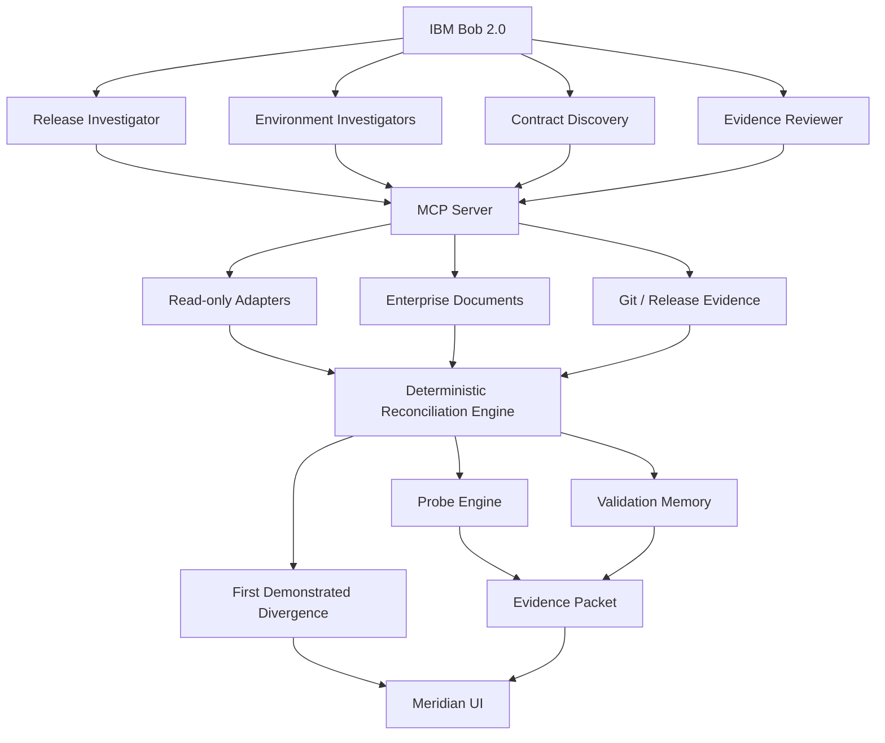

# MERIDIAN

> **Every component passed. The system didn't.**

Meridian is an AI-assisted release-convergence intelligence system for distributed enterprise applications. It reconstructs the exact software composition running across environments, separates observed coexistence from exercised and verified behavior, discovers implicit integration contracts, safely rehearses promotions, executes isolated compatibility probes, and identifies the **First Demonstrated Divergence** with executable proof.

## Product mission

Meridian answers one question:

> **Is the exact system currently running one that has actually been validated together?**

When the answer is no, Meridian identifies which connection became unvalidated, explains the implicit contract at that boundary, safely reproduces the behavior, and assembles traceable evidence.

The core workflow is:

```text
RECONSTRUCT → UNDERSTAND → REHEARSE → PROVE → REMEDIATE
```

- **RECONSTRUCT** — Read-only adapters establish Environment Reality: what is actually running, not what was intended.
- **UNDERSTAND** — Validation memory distinguishes `VERIFIED`, `EXERCISED`, `OBSERVED_TOGETHER`, `UNTESTED`, `FAILED`, and `INCONCLUSIVE` states.
- **REHEARSE** — Counterfactual promotions predict validation impact without changing a target environment.
- **PROVE** — An isolated subprocess probe executes the exact producer/consumer version boundary with deterministic assertions.
- **REMEDIATE** — Bob drafts a candidate compatibility change and Meridian re-runs a regression probe.

## The problem Meridian demonstrates

Large enterprise systems are assembled from independently promoted components. Each team can have passing tests, green pipelines, healthy pods, and successful transport acknowledgements while the exact production combination has never been validated together.

Release `R-26.9` expands `customerId` from 10 to 12 characters and adds mandatory `currencyCode` support.

- **Stage:** `mq-bridge 3.1` + `legacy-ledger 7.0` — `VERIFIED`
- **Production:** `mq-bridge 3.1` was promoted by an Argo CD auto-sync on Friday at 11:42 UTC, while `legacy-ledger` remained at `6.9` until the CR-4471 Sunday change window.

The new producer record is:

```text
CUST12345678USD0000149.50
```

The old `legacy-ledger 6.9` parser reads the first ten customer-ID bytes, silently truncates the value, shifts later fields, and can still return HTTP 200, MQ ACK, and DB COMMIT. Meridian proves the semantic failure instead of treating infrastructure success as business correctness.

## Current demo result

The synthetic demo contains eight components across GKE, EKS, AKS, OpenShift, Kafka, WebSphere Liberty, IBM MQ, and Db2.

- DEV, TEST, and STAGE are converged.
- PROD contains an unvalidated `mq-bridge 3.1 → legacy-ledger 6.9` boundary.
- The First Demonstrated Divergence is `mq-bridge 3.1 → legacy-ledger 6.9` on `IBM MQ · LEDGER.IN`.
- The compatibility probe returns `FAIL` with a silent semantic failure: 9 assertions are evaluated and 3 fail while the technical transport signals remain successful.
- Rehearsing CR-4471 (`ledger-db V15` + `legacy-ledger 7.0`) restores the Stage-validated composition.
- The compatibility-mode candidate holds records that the old ledger cannot represent instead of truncating them.

All environment data, documents, timestamps, versions, and repositories are synthetic and fictional.

## Architecture



The engine is deterministic and does not use model output to decide compatibility. LLM-assisted contract discovery can propose a probe specification, but the executable probe determines `PASS`, `FAIL`, or `INCONCLUSIVE`.

## Repository layout

```text
.
├── apps/api/          FastAPI HTTP layer and routers
├── apps/web/          React 19 + TypeScript + Vite UI
├── engine/            Deterministic reconciliation, evidence, probe, and rehearsal engine
├── mcp-server/        Meridian MCP server and tool catalogue
├── adapters/          Synthetic and base read-only adapters
├── environments/      DEV/TEST/STAGE/PROD snapshots and validation history
├── sample-system/     Versioned source trees for the eight-component demo
├── probes/            Committed probe specifications and seeded summaries
├── documents/         Synthetic PDF, DOCX, and XLSX enterprise artifacts
├── fixtures/          Scenario builder and validation corpus
├── demo/              Reset, seed, demo, and benchmark scripts
├── tests/             Golden and integration tests
├── .bob/              IBM Bob modes, skills, agents, hooks, and rules
├── .meridian/         Runtime evidence and generated working data
├── main.py            Vercel FastAPI entrypoint
├── requirements.txt   Root dependency manifest used by Vercel
└── vercel.json        Vercel frontend build configuration
```

## Local quick start

Requirements: Python 3.11+, Node 18+, npm, and git. Commands below run from the repository root.

```bash
# Install backend/runtime dependencies
python -m pip install -r requirements.txt

# Build the synthetic eight-component scenario and Git repositories
python fixtures/build_scenario.py

# Build the UI; one FastAPI process then serves API, UI, and media
cd apps/web
npm install
npm run build
cd ../..
python -m uvicorn apps.api.main:app --port 8010
# Open http://localhost:8010
```

For UI development, run the API and Vite development server separately:

```bash
python -m uvicorn apps.api.main:app --reload --port 8000
cd apps/web
npm run dev
# Open http://localhost:5173
```

The Vite development server proxies `/api` and `/media` to `localhost:8000`. The production UI uses same-origin `/api` calls, so it does not require a hard-coded backend URL.

The demo wrappers in `demo/` are intended for macOS/Linux shells:

```bash
./demo/reset.sh
./demo/seed.sh
./demo/run-demo.sh
./demo/benchmark.sh
```

The cross-platform Python demo entrypoint is:

```bash
python demo/run_demo.py
```

## Tests and validation

Run the golden chain:

```bash
python -m pytest tests/test_golden.py -v
```

The golden tests verify the complete scenario, including:

- Stage `mq-bridge 3.1` + `legacy-ledger 7.0` is verified.
- Production reality comes from adapter output rather than the release manifest.
- Production `mq-bridge 3.1` + `legacy-ledger 6.9` is unvalidated until the isolated probe runs.
- The failed probe detects the silent customer-ID, currency, and amount semantic errors.
- The First Demonstrated Divergence is the `mq-bridge → legacy-ledger` boundary.
- DEV, TEST, and STAGE are converged.
- CR-4471 rehearsal converges production.
- Compatibility-mode regression behavior passes.
- The PreToolUse safety guard blocks target-environment mutation commands.

The current local validation result is **9 tests passed**. The frontend production build is:

```bash
cd apps/web
npm run build
```

## IBM Bob integration

Meridian is designed to run inside IBM Bob. Opening the repository in Bob provides the project context and operating procedures.

- **Custom modes:** `.bob/custom_modes.yaml` defines investigator, probe-engineer, remediator, and demo modes.
- **Skills:** release investigation, environment reconstruction, implicit contract discovery, probe generation, and evidence review.
- **MCP server:** `mcp-server/meridian_mcp.py` exposes the Meridian tool catalogue. Use `python mcp-server/meridian_mcp.py --list` to inspect it.
- **Agents:** `.bob/agents/` contains reusable release, environment, contract, and evidence-review prompts.
- **Rules:** `AGENTS.md` and `.bob/rules-meridian/` define evidence language, safety boundaries, and product terminology.
- **Hooks:** `.bob/hooks/guard.py` blocks dangerous environment mutation commands and `.bob/hooks/log_activity.py` records investigation activity.

Evidence rules are strict: every finding has an evidence ID; `VERIFIED` requires passing validation evidence; `FAILED` requires a deterministic probe result; and `INCONCLUSIVE` is preserved rather than hidden.

## Safety boundary

Meridian is read-only against target environments.

- Target environment adapters read state only.
- Meridian never runs deployment or infrastructure mutation commands against real targets.
- Probe execution uses subprocess isolation, no target credentials, and no configured network endpoints.
- Promotion rehearsal is counterfactual and never deploys anything.
- Evidence and candidate artifacts are written only under `.meridian/` during local operation.

The repository includes synthetic data only. Do not point the adapters or probes at real infrastructure without an explicit, separately reviewed integration design.

## Vercel deployment

The production deployment is a single Vercel project containing the Vite-built React UI and the FastAPI application:

- **Live application:** [meridian-release-convergence.vercel.app](https://meridian-release-convergence.vercel.app)
- **Git repository:** [github.com/ashfaque-rifaye/project-meridian](https://github.com/ashfaque-rifaye/project-meridian)
- **Vercel project:** [Meridian Release Convergence](https://vercel.com/ashfaques-projects-f955ce95/meridian-release-convergence)
- **Python entrypoint:** root `main.py`, which exports `apps.api.main:app`.
- **Build command:** `npm --prefix apps/web ci && npm --prefix apps/web run build`.
- **Runtime configuration:** `vercel.json`, root `requirements.txt`, and `.vercelignore`.

Deploy from the repository root after authenticating with Vercel:

```bash
vercel login
vercel link --yes --scope <vercel-scope> --project <project-name>
vercel deploy --prod --yes --scope <vercel-scope>
```

The deployment serves:

- `/` — React application shell.
- `/api/*` — FastAPI routes for composition, environments, evidence, probes, rehearsals, remediation, and Bob integration.
- `/health` — API health check.
- `/media/*` — ambient UI video assets.
- `/slides.html` — interactive six-slide Meridian pitch deck.
- `/api/documents/*` — synthetic PDF, DOCX, and XLSX artifacts.

The current hosted smoke checks pass for the homepage, health route, API metadata and overview, divergence endpoint, pitch deck, media, and isolated probe. A fresh production overview reports Stage `CONVERGED`, PROD `DIVERGED`, and the expected `mq-bridge 3.1 → legacy-ledger 6.9` First Demonstrated Divergence.

### Serverless runtime note

Vercel functions have a read-only deployment bundle and ephemeral writable storage. Meridian therefore:

- Reads committed environments, documents, version trees, and probe summaries from the deployment bundle.
- Uses a serverless-safe source-tree fallback when the Vercel runtime does not provide the `git` executable.
- Writes new probe runs, evidence packets, rehearsals, and sandboxes under `/tmp/meridian`.
- Seeds the expected demo probe state from committed probe summaries on cold start.

Generated runtime evidence is not durable across function instances. Use persistent storage or a dedicated backend service if a deployment needs durable multi-user investigation history.

## Terminology

| Term | Meaning |
|---|---|
| Environment Reality | What is actually running, not what was intended |
| Validation Evidence | Proof that a specific version combination was exercised successfully |
| Implicit Contract | A compatibility assumption existing in code or documents but not a formal machine-readable specification |
| Compatibility Probe | An isolated executable test of a specific version boundary |
| Release Convergence | All components running the combination that was validated together |
| First Demonstrated Divergence | The earliest boundary where running versions lack sufficient evidence and the probe fails |
| Promotion Rehearsal | A simulation of a promotion that does not deploy anything |
| Evidence Packet | A traceable bundle of facts behind a First Demonstrated Divergence finding |

> We are not monitoring whether your services are alive. We are proving whether the system you assembled is the system you actually tested.

---

*All data in this repository is synthetic and fictional. The ambient background videos in `apps/web/media/` were generated with Google Flow (Veo 3.1).* IBM Bob task-session screenshots are stored in [`bob_sessions/`](bob_sessions/). The repository is licensed under the [MIT License](LICENSE).
