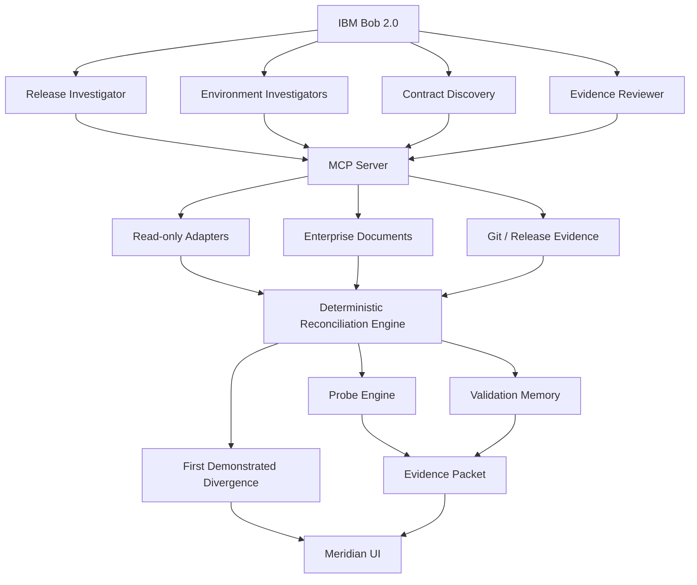

# MERIDIAN

> **Every component passed. The system didn't.**

Meridian is an AI-assisted release-convergence system for distributed enterprise applications. It reconstructs the exact software composition running across environments, distinguishes observed coexistence from actual validation evidence, discovers implicit integration contracts, safely rehearses unvalidated version combinations, and identifies the first demonstrated release divergence.

---

## The Problem

Large enterprise systems are not deployed as a single unit. Different teams promote different components at different times. The result is a production system assembled from independent releases — a combination that may never have been validated together.

**Every component can pass its own tests. Every deployment can be green. Every health check can be healthy. And yet the resulting Production combination was never validated.**

This is the dangerous state Meridian addresses.

## What Meridian Does

```
RECONSTRUCT → UNDERSTAND → REHEARSE → PROVE → REMEDIATE
```

1. **RECONSTRUCT** — What is actually running in each environment?
2. **UNDERSTAND** — What combination exists now that was never validated?
3. **REHEARSE** — What happens if we promote this version to Production now?
4. **PROVE** — Execute an isolated compatibility probe. Proof, not prediction.
5. **REMEDIATE** — Draft a candidate fix. Re-run the probe.

## The Demo Scenario

Release R-26.9 increases `customerId` from 10 to 12 characters and adds mandatory `currencyCode` support.

- **Stage**: `mq-bridge 3.1` + `legacy-ledger 7.0` — ✓ VERIFIED
- **Prod**: `mq-bridge 3.1` promoted Friday. `legacy-ledger` stayed at `6.9` (Saturday CAB window).

Result: Production is running a combination that was **never validated**.

The new fixed-width record from mq-bridge 3.1:
```
CUST12345678USD0000149.50
```

The old parser in legacy-ledger 6.9:
```
customerId[0:10] = "CUST123456"  ← WRONG (truncated silently)
```

HTTP 200. MQ ACK. DB COMMIT. Pod HEALTHY. Business data: **WRONG**.

## Architecture



## Quick Start

```bash
# Reset demo state
./demo/reset.sh

# Seed demo data
./demo/seed.sh

# Run complete demo
./demo/run-demo.sh

# Run benchmarks
./demo/benchmark.sh

# Start backend API
cd apps/api
pip install -r requirements.txt
uvicorn main:app --reload --port 8000

# Start frontend
cd apps/web
npm install
npm run dev
```

## Golden Tests

```bash
python tests/test_golden.py
```

All 6 golden tests must pass:
- Stage: mq-bridge 3.1 + legacy-ledger 7.0 → VERIFIED
- Prod: mq-bridge 3.1 + legacy-ledger 6.9 → UNTESTED
- Probe → FAILED (customer_id truncated CUST12345678 → CUST123456)
- Infrastructure appears healthy (HTTP 200, MQ ACK, DB COMMIT)
- First Demonstrated Divergence: mq-bridge 3.1 → legacy-ledger 6.9
- Stage has no divergence

## IBM Bob Integration

- **Custom modes**: `meridian-investigator`, `meridian-probe-engineer`, `meridian-remediator`, `meridian-demo`
- **Skills**: release-investigation, environment-reconstruction, implicit-contract-discovery, probe-generation, evidence-review
- **MCP**: 12 read-only tools served by the `meridian` MCP server
- **Hooks**: `block-dangerous-tools.sh` (PreToolUse) — blocks all environment-mutation commands

## Safety

Meridian is **read-only against target environments**.

- Target environment tools are read-only
- Dangerous commands are blocked by PreToolUse hook
- Probes execute in subprocess isolation only
- No production mutation is possible during investigation

## Terminology

| Term | Meaning |
|---|---|
| Environment Reality | What is actually running (not what was intended) |
| Validation Evidence | Proof that a specific combination was exercised successfully |
| Implicit Contract | Compatibility assumption existing only in code/docs |
| Compatibility Probe | Isolated executable test of a specific version boundary |
| First Demonstrated Divergence | Earliest boundary where running versions lack evidence AND probe fails |
| Promotion Rehearsal | Simulate a deployment without deploying |
| Evidence Packet | Traceable bundle of all facts behind a finding |

---

> We are not monitoring whether your services are alive. We are proving whether the system you assembled is the system you actually tested.

---

*All data in this repository is synthetic and fictional. Environment snapshots, deployment timestamps, component versions, and validation records are created for demonstration purposes only.*
