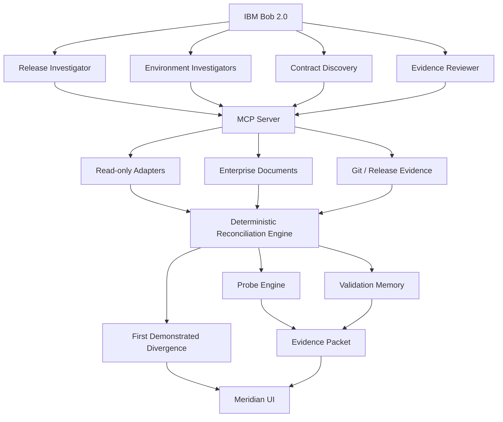

# MERIDIAN

> **Every component passed. The system didn't.**

Meridian is an AI-assisted release-convergence system for distributed enterprise applications. It reconstructs the exact software composition running across environments, distinguishes observed coexistence from actual validation evidence, discovers implicit integration contracts, safely rehearses unvalidated version combinations, and identifies the first demonstrated release divergence.

---

## The Problem

Large enterprise systems are not deployed as a single unit. Different teams promote different components at different times. The result is a production system assembled from independent releases — a combination that may never have been validated together.

**Every component can pass its own tests. Every deployment can be green. Every health check can be healthy. And yet the resulting Production combination was never validated.**

This is the dangerous state Meridian addresses.

## What Meridian Does

```
RECONSTRUCT → UNDERSTAND → REHEARSE → PROVE → REMEDIATE
```

1. **RECONSTRUCT** — What is actually running in each environment?
2. **UNDERSTAND** — What combination exists now that was never validated?
3. **REHEARSE** — What happens if we promote this version to Production now?
4. **PROVE** — Execute an isolated compatibility probe. Proof, not prediction.
5. **REMEDIATE** — Draft a candidate fix. Re-run the probe.

## The Demo Scenario

Release R-26.9 increases `customerId` from 10 to 12 characters and adds mandatory `currencyCode` support.

- **Stage**: `mq-bridge 3.1` + `legacy-ledger 7.0` — ✓ VERIFIED
- **Prod**: `mq-bridge 3.1` promoted by an Argo CD auto-sync on Friday at 11:42 UTC. `legacy-ledger` stayed at `6.9`, waiting for the Sunday 02:00 UTC change window (CR-4471).

Result: Production is running a combination that was **never validated**.

The new fixed-width record from mq-bridge 3.1:
```
CUST12345678USD0000149.50
```

The old parser in legacy-ledger 6.9:
```
customerId[0:10] = "CUST123456"  ← WRONG (truncated silently)
```

HTTP 200. MQ ACK. DB COMMIT. Pod HEALTHY. Business data: **WRONG**.

## Architecture



## Quick Start

Requires Python 3.11+, Node 18+ and git. Commands run from the repository root.

```bash
pip install -r apps/api/requirements.txt
python fixtures/build_scenario.py        # builds the 8 component git repos the probes run against

# Build the UI once; a single process then serves the API, the UI and the media
cd apps/web && npm install && npm run build && cd ../..
python -m uvicorn apps.api.main:app --port 8010
# open http://localhost:8010

# End-to-end chain in the terminal (no UI needed)
python demo/run_demo.py
```

For UI development, run `npm run dev` in `apps/web` (port 5173) next to the API on port 8000.

The bash scripts in `demo/` (`reset.sh`, `seed.sh`, `run-demo.sh`, `benchmark.sh`) wrap the same steps for macOS/Linux.

## Golden Tests

```bash
python -m pytest tests/ -v
python tests/mcp_smoke.py
```

The 9 golden tests assert the full chain:
- Stage: mq-bridge 3.1 + legacy-ledger 7.0 → VERIFIED
- Prod: mq-bridge 3.1 + legacy-ledger 6.9 → never validated
- Prod reality comes from adapter outputs, not from the release manifest
- Probe → FAILED silently (CUST12345678 posted as CUST123456, 149.50 posted as 780000149.00, while HTTP 200 / MQ ACK / DB COMMIT)
- First Demonstrated Divergence: mq-bridge 3.1 → legacy-ledger 6.9
- DEV, TEST and STAGE are converged
- Rehearsing CR-4471 (ledger-db V15 + legacy-ledger 7.0) converges PROD
- Bridge compatibility mode passes the regression probe
- The PreToolUse guard blocks environment mutation

## IBM Bob Integration

- **Custom modes** (`.bob/custom_modes.yaml`): `meridian-investigator`, `meridian-probe-engineer`, `meridian-remediator`, `meridian-demo`
- **Skills** (`.bob/skills/`): release-investigation, environment-reconstruction, implicit-contract-discovery, probe-generation, evidence-review
- **MCP** (`mcp-server/meridian_mcp.py`, registered in `.bob/mcp.json`): 22 tools. 17 are read-only, 3 execute only in the probe sandbox (`run_probe`, `simulate_promotion`, `verify_remediation`) and 2 write only under `.meridian/`. Run `python mcp-server/meridian_mcp.py --list` for the catalogue.
- **Hooks** (`.bob/settings.json`): `guard.py` (PreToolUse on `execute_command`) exits with code 2 on mutating kubectl, oc, helm, argocd, terraform, aws, az, gcloud, flyway, Db2, MQ admin and git push commands; `log_activity.py` (PostToolUse) records Bob's tool calls for the UI.
- **Agent prompts** (`.bob/agents/`): release investigator, environment investigator, contract discovery and evidence reviewer.

## Safety

Meridian is **read-only against target environments**.

- Target environment tools are read-only
- Dangerous commands are blocked by PreToolUse hook
- Probes execute in subprocess isolation only
- No production mutation is possible during investigation

## Terminology

| Term | Meaning |
|---|---|
| Environment Reality | What is actually running (not what was intended) |
| Validation Evidence | Proof that a specific combination was exercised successfully |
| Implicit Contract | Compatibility assumption existing only in code/docs |
| Compatibility Probe | Isolated executable test of a specific version boundary |
| First Demonstrated Divergence | Earliest boundary where running versions lack evidence AND probe fails |
| Promotion Rehearsal | Simulate a deployment without deploying |
| Evidence Packet | Traceable bundle of all facts behind a finding |

---

> We are not monitoring whether your services are alive. We are proving whether the system you assembled is the system you actually tested.

---

*All data in this repository is synthetic and fictional. Environment snapshots, deployment timestamps, component versions, and validation records are created for demonstration purposes only. The ambient background videos in `apps/web/media/` were generated with Google Flow (Veo 3.1).*

IBM Bob task session screenshots for the hackathon are in [`bob_sessions/`](bob_sessions/). Licensed under the [MIT License](LICENSE).
