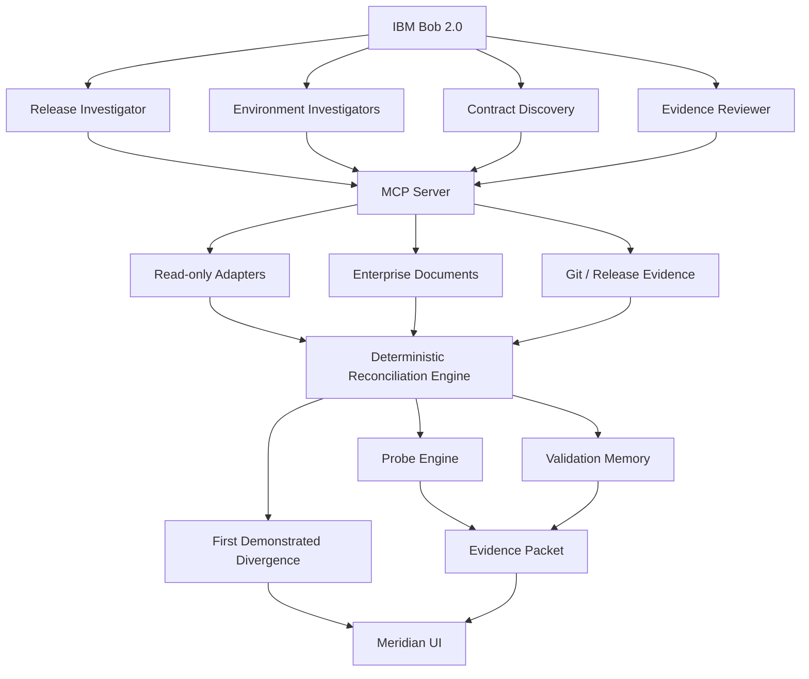

# Architecture

## Overview

Meridian is built in three layers:

1. **Deterministic Engine** — Python. Owns version reconciliation, validation state, First Divergence algorithm, probe execution, and evidence assembly. No LLM calls.
2. **IBM Bob AI Layer** — Custom modes, skills, agents, and MCP tools. Bob reads evidence and proposes probes. The deterministic engine evaluates them.
3. **React UI** — Presents the complete investigation chain from Command Center through to evidence and remediation.

## Mermaid Diagram

## Component Details

### Deterministic Engine (`engine/`)

| Module | Purpose |
|---|---|
| `domain/models.py` | Core dataclasses (Component, ValidationEvidence, ProbeSpec, FirstDivergence, etc.) |
| `domain/flows.py` | Business flow definitions (Order-to-Ledger, 6 dependency edges) |
| `reconciliation/reconciler.py` | Load and normalize environment snapshots from adapter fixtures |
| `validation/memory.py` | Track validation evidence; determine VERIFIED/UNTESTED/FAILED state per edge |
| `divergence/first_divergence.py` | Traverse flow edges; find first UNTESTED + FAILED probe = First Divergence |
| `probes/probe_engine.py` | Generate and execute compatibility probes in subprocess isolation |
| `rehearsal/rehearsal.py` | Simulate promotions; predict validation impact without deploying |
| `evidence/` | Evidence packet assembly |

### MCP Server (`mcp/server/server.py`)

12 read-only tools available to IBM Bob:
- `get_release_intent` — R-26.9 release scope
- `get_environment_snapshot` — actual running versions
- `get_environment_history` — deployment timeline
- `get_validation_history` — evidence records per edge
- `get_untested_edges` — unvalidated boundaries
- `get_interface_document` — fixed-width format spec
- `get_change_request` — CR-4471 CAB document
- `get_release_notes` — R-26.9 compatibility warnings
- `get_first_divergence` — deterministic divergence result
- `run_probe` — execute probe in isolation
- `simulate_promotion` — rehearsal without deployment
- `get_business_flow` — flow definition

### React UI (`apps/web/`)

9 screens covering the complete investigation workflow:
1. Command Center — release status, First Divergence summary, actions
2. Release Journey — temporal timeline
3. System Composition — component × environment matrix
4. Dependency Explorer — interactive edge inspection
5. First Divergence — forensic evidence view
6. Probe Console — live probe execution
7. Evidence Drawer — expandable evidence items
8. Promotion Rehearsal — counterfactual simulation
9. Bob Investigation — parallel agent execution view

### IBM Bob Configuration (`.bob/`)

| File | Purpose |
|---|---|
| `mcp.json` | MCP server registration |
| `custom_modes.yaml` | 4 custom modes (investigator, probe-engineer, remediator, demo) |
| `settings.json` | PreToolUse + PostToolUse hooks |
| `hooks/block-dangerous-tools.sh` | Blocks kubectl/helm/terraform/aws/az/gcloud mutations |
| `skills/*/SKILL.md` | 5 specialist skills |
| `agents/*.md` | Reusable agent prompts |
| `rules-meridian/*.md` | Standing project rules |

## Design Decisions

See `docs/decisions.md` for implementation choices.
